# CV2WEB Current Pipeline - Updated 2025-07-03

```mermaid
graph TD
    %% Frontend Integration
    React[⚛️ React App] -->|CORS Enabled| API[🚀 FastAPI]
    
    %% Authentication Flow
    API -->|/register, /login| Auth[🔐 Auth Service]
    Auth -->|Keychain| Keys[🔑 macOS Keychain]
    Auth -->|User Data| DB[(SQLite)]
    
    %% CV Upload Flow
    API -->|/upload| Upload[📤 Upload Service]
    Upload -->|Validate| Check{File OK?}
    Check -->|No| Error[❌ Error Response]
    Check -->|Yes| Save[💾 Save File]
    
    %% Text Extraction Flow
    Save -->|Extract Text| Extract[📄 Text Extractor]
    Extract -->|PDF/DOCX/TXT| Local[📝 Local Parser]
    Extract -->|Images| OCR{OCR Service}
    OCR -->|Primary| GVision[👁️ Google Vision]
    OCR -->|Fallback| AWS[📸 AWS Textract]
    
    %% AI Processing Flow (17 Sections)
    Extract -->|Raw Text| AI[🤖 Data Extractor]
    AI -->|Primary| Gemini[✨ Gemini 2.0]
    AI -->|Fallback| Claude[🧠 Claude Sonnet]
    AI -->|17 Sections| CVData[📋 CV Data Schema]
    
    %% Smart Deduplication
    Extract -->|Text| Dedup[🧹 Smart Deduplicator]
    Dedup -->|Fuzzy Matching| AI
    
    %% Component Selection
    CVData -->|Archetype| Selector[🎨 Component Selector]
    Selector -->|AI Analysis| Components[🎯 Aceternity Components]
    
    %% Portfolio Generation
    Components -->|100+ Components| Generator[🏗️ Portfolio Generator]
    Generator -->|Next.js 14| Portfolio[🌐 Generated Site]
    Generator -->|Copy Components| Aceternity[📦 UI Library]
    
    %% Response
    Portfolio -->|Deploy Ready| Response[✅ Portfolio URL]
    Response -->|Return to| React
    
    %% Credentials
    GVision -.->|Creds| Keys
    AWS -.->|Creds| Keys
    Gemini -.->|Creds| Keys
    Claude -.->|Creds| Keys
    
    %% Styling
    style React fill:#61DAFB
    style API fill:#009688
    style Auth fill:#2196F3
    style Keys fill:#FFC107
    style DB fill:#FF9800
    style Extract fill:#4CAF50
    style OCR fill:#9C27B0
    style Error fill:#f44336
    style Generator fill:#673AB7
    style Portfolio fill:#00BCD4
```

## ✅ What Works Now

### 1. Complete End-to-End Pipeline
- **CV Upload** → **Text Extraction** → **AI Analysis** → **Component Selection** → **Portfolio Generation**
- ~20 seconds from CV upload to running Next.js site

### 2. Text Extraction
- All document formats: PDF, DOCX, TXT, MD, RTF, HTML
- OCR for images (Google Vision + AWS Textract)
- Unicode normalization (fixes ligatures, quotes)
- Smart deduplication with fuzzy matching

### 3. AI-Powered Data Extraction
- 17 different CV sections extracted:
  - Hero (name, title, summary)
  - Experience (work history)
  - Education (degrees, institutions)
  - Skills (technical, soft)
  - Projects (portfolio pieces)
  - Certifications & Licenses
  - Achievements & Awards
  - Publications & Research
  - Speaking Engagements
  - Patents
  - Professional Memberships
  - Volunteer Experience
  - Languages
  - Courses
  - Hobbies & Interests
  - Contact Information
- Gemini 2.0 Flash (primary) + Claude Sonnet (fallback)
- Parallel extraction for speed

### 4. Smart Component Selection
- AI analyzes CV to determine user archetype:
  - Technical/Developer → Code blocks, terminals, grids
  - Business/Marketing → Professional gradients, testimonials
  - Creative/Designer → 3D cards, parallax effects
  - Academic/Researcher → Timelines, publication lists
- Selects best-fitting Aceternity components

### 5. Portfolio Generation
- Integrates 100+ real Aceternity UI components
- Generates complete Next.js 14 app with:
  - TypeScript/React components
  - Tailwind CSS styling
  - Framer Motion animations
  - Responsive design
  - Dark mode support
- Automatic component copying and import fixing
- Production-ready code

### 6. Authentication & Session Management
- User registration & login
- Session-based auth with SQLite
- Secure credential storage in macOS Keychain

## 🚧 In Progress

### High Priority Issues
- [ ] JSON parsing errors in achievements section
- [ ] Better error recovery for failed extractions
- [ ] Add extraction quality validation

### Feature Development
- [ ] Real-time preview mode
- [ ] Multiple theme selection
- [ ] Custom component mappings
- [ ] Deploy to Vercel integration

## 🎯 Next Steps

1. **Improve Reliability**
   - Add JSON validation before saving
   - Implement retry logic for AI calls
   - Better error messages

2. **Enhanced Features**
   - Component preview gallery
   - Custom color schemes
   - Font selection
   - Layout variations

3. **Production Ready**
   - Add monitoring/analytics
   - Implement caching
   - Optimize for scale
   - Add deployment automation

## 📊 Performance Metrics

- **Text Extraction**: <1 second
- **AI Processing**: 10-15 seconds (parallel)
- **Component Selection**: <2 seconds
- **Portfolio Generation**: <5 seconds
- **Total Pipeline**: ~20 seconds

## 🔧 Technical Stack

- **Backend**: FastAPI, Python 3.11+
- **AI**: Google Gemini 2.0, Anthropic Claude
- **OCR**: Google Vision, AWS Textract
- **Frontend**: Next.js 14, React 18, TypeScript
- **UI**: Aceternity Components, Tailwind CSS
- **Animation**: Framer Motion
- **Database**: SQLite (sessions)
- **Auth**: Custom session management