# CV2WEB Current Pipeline - Updated January 2025

```mermaid
graph TD
    %% Frontend Flow
    NextJS[🌐 Next.js App] -->|Auth Headers| API[🚀 FastAPI]
    
    %% Authentication Flow
    API -->|/auth/login, /auth/register| Auth[🔐 Auth Service]
    Auth -->|Sessions| DB[(SQLite)]
    Auth -->|Credentials| Keys[🔑 Keychain Manager]
    
    %% CV Upload & Processing Flow
    API -->|/upload-cv| Upload[📤 Upload Service]
    Upload -->|Validate| Check{Valid File?}
    Check -->|No| Error[❌ Error Response]
    Check -->|Yes| Store[💾 Store Original]
    
    %% Text Extraction
    Store -->|Extract| Extract[📄 Text Extractor]
    Extract -->|PDF/DOCX| Local[📝 Local Parser]
    Extract -->|Images| OCR{OCR Service}
    OCR -->|Primary| GVision[👁️ Google Vision]
    OCR -->|Fallback| AWS[📸 AWS Textract]
    
    %% AI Processing (Claude 4 Opus ONLY)
    Extract -->|Raw Text| Claude[🧠 Claude 4 Opus]
    Claude -->|Temperature 0.0| Extraction[🎯 Deterministic Extraction]
    Extraction -->|18 Sections| CVData[📋 CV Data]
    
    %% Advanced Classification
    CVData -->|Section Analysis| Classifier[🔍 Advanced Classifier]
    Classifier -->|Deduplication| Clean[🧹 Clean Data]
    
    %% CV Editor Flow
    Clean -->|Display| Editor[✏️ CV Editor]
    Editor -->|User Edits| Save[💾 Save Changes]
    Save -->|Update| DB
    
    %% Portfolio Generation
    Editor -->|Generate| Expert[🤖 Portfolio Expert]
    Expert -->|AI Guidance| Template[🎨 Template Selection]
    Template -->|v1.5 or v2.1| Generator[🏗️ Portfolio Generator]
    
    %% Sandbox Environment
    Generator -->|Create Sandbox| Sandbox[📦 Isolated Environment]
    Sandbox -->|npm install| Install[⚙️ Dependencies]
    Install -->|Start Server| Server[🚀 Dev Server]
    Server -->|Unique Port| Preview[👁️ Live Preview]
    
    %% Deployment
    Preview -->|User Approves| Deploy[🌍 Deploy to Vercel]
    Deploy -->|One Click| Live[✅ Live Portfolio]
    
    %% Data Flow
    DB -.->|CV Data| Editor
    DB -.->|File Info| Upload
    Keys -.->|API Keys| Claude
    Keys -.->|OAuth| Auth
    
    %% Styling
    style NextJS fill:#000000
    style API fill:#009688
    style Auth fill:#2196F3
    style DB fill:#FF9800
    style Claude fill:#7C3AED
    style Sandbox fill:#10B981
    style Live fill:#00BCD4
```

## ✅ What Works Now

### 1. Complete End-to-End Pipeline
- **CV Upload** → **AI Extraction** → **CV Editor** → **Portfolio Generation** → **Live Preview**
- File preservation with secure download
- Real-time progress tracking (simulated for better UX)

### 2. Text Extraction & Processing
- **Supported formats**: PDF, DOCX, TXT, PNG, JPG, JPEG
- **OCR capabilities**: Google Vision (primary) + AWS Textract (fallback)
- **Text normalization**: Unicode fixes, smart deduplication
- **File size limit**: 10MB per upload
- **Multi-file support**: Process multiple images together

### 3. AI-Powered Data Extraction
- **Claude 4 Opus ONLY** with temperature 0.0 for deterministic results
- **18 CV sections** extracted:
  - Hero (name, title, summary)
  - Contact (email, phone, location)
  - Experience (work history with achievements)
  - Education (degrees, institutions, dates)
  - Skills (categorized technical skills)
  - Projects (portfolio pieces)
  - Certifications & Licenses
  - Achievements & Awards
  - Publications & Research
  - Speaking Engagements
  - Patents
  - Professional Memberships
  - Volunteer Experience
  - Languages
  - Courses & Training
  - Hobbies & Interests
  - References
  - Social Links
- **Advanced classification**: Prevents cross-section contamination
- **Confidence scoring**: Caches high-confidence extractions (≥75%)

### 4. CV Editor
- **Full CRUD operations** on all CV sections
- **Add/remove/reorder** list items (experience, education, skills)
- **Real-time validation** and saving
- **Original file display** with PDF viewer
- **Direct flow**: Upload → Extract → Edit → Generate

### 5. Portfolio Generation System
- **Isolated sandbox environments** for each portfolio
- **Template options**: v1.5 and v2.1 with different styles
- **Data adapters**: Transform CV data to template format
- **Live preview**: Unique ports (4000+) for each instance
- **Server management**: Start/stop/restart controls
- **Health monitoring**: Real-time status checks
- **npm-based**: Better compatibility than pnpm in sandboxes

### 6. Authentication & Security
- **Email/password** registration and login
- **Google OAuth** integration (ready)
- **Session-based auth** with SQLite
- **Secure headers**: X-Session-ID for API calls
- **File access control**: Only owners can download originals

## 🚧 In Progress

### Payment System
- [ ] Stripe/PayPal integration for three tiers
- [ ] Go Live ($14.90) - Basic with branding
- [ ] Get Hired ($19.90) - Premium features
- [ ] Turn Heads ($89.90) - Custom design service

### Portfolio Expert UI
- [ ] Frontend interface for AI guidance
- [ ] Chat-based portfolio recommendations
- [ ] Template preview with customizations

### Enhancement Tasks
- [ ] Multiple portfolio management UI
- [ ] Template marketplace
- [ ] Custom domain connection
- [ ] Analytics dashboard

## 🎯 Next Steps

1. **Payment Integration**
   - Backend payment processing endpoints
   - Subscription management
   - Refund system for Get Hired plan
   - Monthly hosting billing

2. **Performance Optimization**
   - Portfolio generation under 10 seconds
   - Parallel sandbox creation
   - Template caching system
   - CDN for static assets

3. **Enterprise Features**
   - Team accounts
   - White-label options
   - API access
   - Bulk processing

## 📊 Performance Metrics

- **Text Extraction**: <1 second
- **Claude 4 Extraction**: 8-12 seconds
- **CV Editor Load**: <2 seconds
- **Portfolio Generation**: 15-25 seconds
- **Live Preview Ready**: 20-30 seconds total

## 🔧 Technical Stack

### Backend
- **Framework**: FastAPI (Python 3.11+)
- **Database**: SQLite (sessions, CV data)
- **AI**: Claude 4 Opus (deterministic mode)
- **OCR**: Google Vision, AWS Textract
- **Auth**: Session-based + OAuth ready

### Frontend
- **Framework**: Next.js 15, React 18
- **Language**: TypeScript
- **Styling**: Tailwind CSS v4
- **UI Libraries**: Aceternity UI, Magic UI
- **State**: React Context + Hooks

### Infrastructure
- **Deployment**: Vercel
- **Sandboxes**: Isolated Node.js environments
- **Package Manager**: pnpm (main), npm (sandboxes)
- **Monitoring**: Built-in health checks

## 🔒 Security Features

- **Input validation**: File type and size limits
- **Authentication**: Secure session management
- **File isolation**: User files in separate directories
- **CSP headers**: Configured for iframe embedding
- **API rate limiting**: Prevents abuse
- **Secure credentials**: Keychain manager for API keys